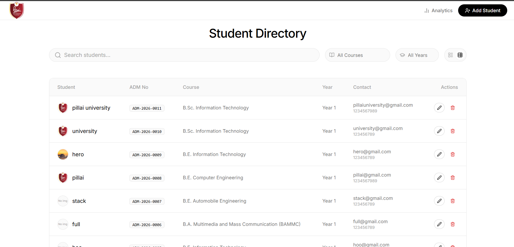
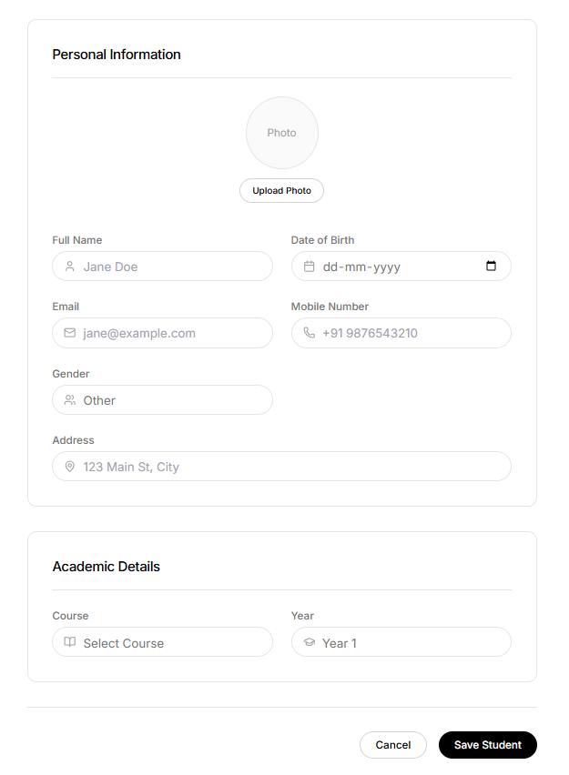
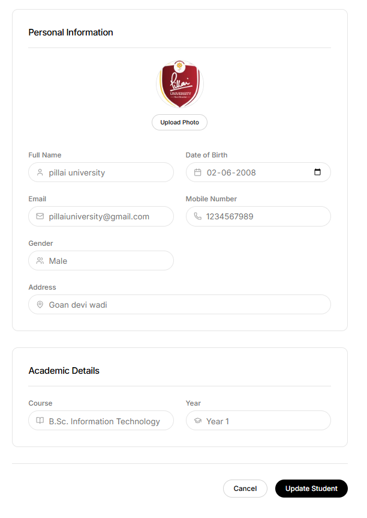
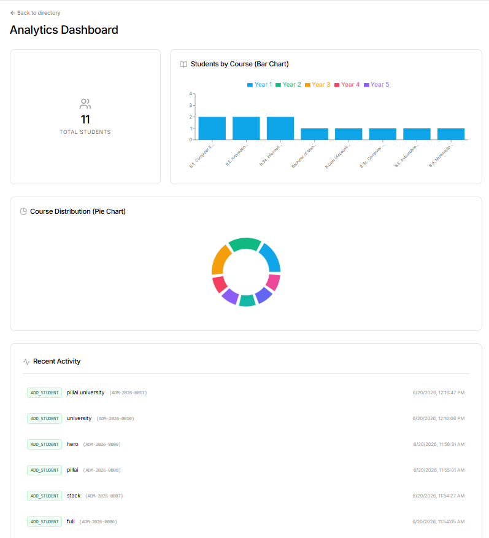
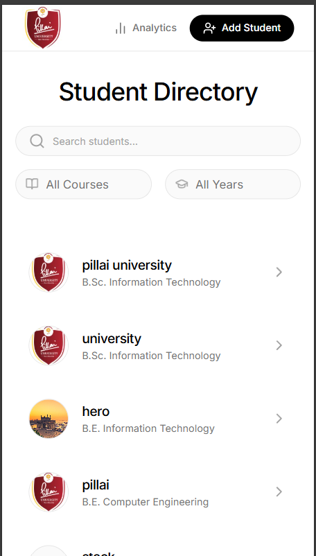
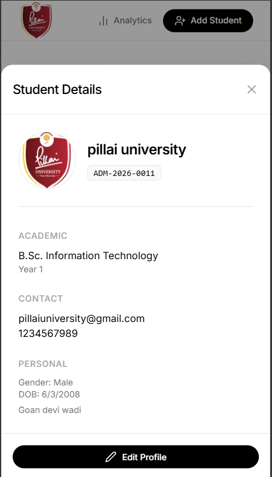
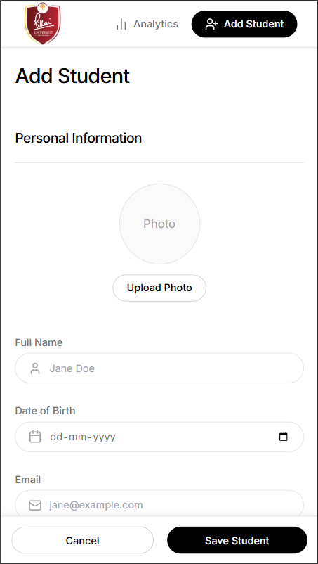

# Pillai University Student Management System

A full-stack, responsive web application built for Pillai University (Panvel Campus) to manage student records, view detailed analytics, and streamline administrative workflows. Designed with a modern, mobile-first UI using Tailwind CSS and Recharts.

## 🚀 Technologies Used

### Frontend
- **React.js** (Vite)
- **Tailwind CSS** (Custom design system, fluid typography, responsive layouts)
- **React Router** (Client-side routing)
- **Recharts** (Interactive data visualization: Stacked Bar Charts, Pie Charts)
- **React Hook Form** (Form validation & state management)
- **Lucide React** (Modern SVG icons)
- **Axios** (API requests)

### Backend
- **Node.js & Express.js** (REST API)
- **PostgreSQL** (Relational Database)
- **Multer** (Handling image uploads)
- **CORS** (Cross-Origin Resource Sharing)

---

## 🛠️ Setup Instructions

### 1. Database Configuration
Ensure PostgreSQL is installed and running on your machine.
1. Create a new database in PostgreSQL (e.g., `student_db`).
2. Run the provided `backend/init.sql` script to create the necessary `students` and `activity_logs` tables.

### 2. Backend Setup
1. Navigate to the backend directory:
   ```bash
   cd backend
   ```
2. Install dependencies:
   ```bash
   npm install
   ```
3. Configure the `.env` file in the backend folder:
   ```env
   PORT=5000
   DB_USER=postgres
   DB_PASSWORD=your_password
   DB_HOST=localhost
   DB_PORT=5432
   DB_NAME=student_db
   ```
4. Start the backend server:
   ```bash
   npm run dev
   ```

### 3. Frontend Setup
1. Navigate to the frontend directory:
   ```bash
   cd frontend
   ```
2. Install dependencies:
   ```bash
   npm install
   ```
3. Start the Vite development server:
   ```bash
   npm run dev
   ```
4. Open `http://localhost:5173` in your browser.

---

## 🔌 API Endpoints

| Method | Endpoint | Description |
| :--- | :--- | :--- |
| **GET** | `/api/students` | Fetch paginated list of students. Supports `?search=`, `?filterCourse=`, and `?filterYear=` query parameters. |
| **POST** | `/api/students` | Add a new student record (supports `multipart/form-data` for image uploads). |
| **PUT** | `/api/students/:id` | Update an existing student record. |
| **DELETE** | `/api/students/:id` | Drop a student from the directory. |
| **GET** | `/api/analytics` | Fetch aggregation data for dashboards (Total students, Course distribution, Recent activity logs). |

---

## 📸 Screenshots

### Desktop Interface
**Main Directory (Table View)**


**Add Student Form**


**Edit Student Record**


**Analytics & Visualizations**


### Mobile / Responsive Interface
**Main Directory (List View)**


**Student Detail Modal (Mobile)**


**Add Student Form (Mobile)**

